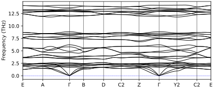
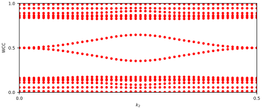
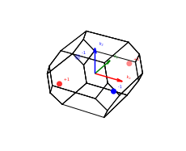
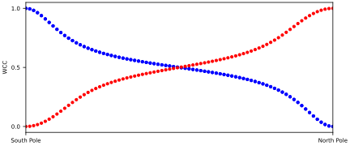

<a name="readme-top"></a>

<div align="center">


<h1 align="center">Welcome to Phonnier!</h3>
 <h3 align="center"><ins>Phon</ins>on Wan<ins>nier</ins></h3>

This code tries to adapt the Wannier Orbital formalism to the calculation of topological propperties of Phonon systems, with emphasis on polar materials, i.e., in the case of LO-TO splitting.

</div>

<!-- Index -->
<details>
  <summary>Table of Contents</summary>
  <ol>
    <li>
      <a href="#what-is-phonnier">What is Phonnier?</a>
    </li>
    <li>
      <a href="#how-to-use-phonnier">How to use Phonnier</a>
    </li>
    <li>
	<a href="#capabilities">Capabilities</a>
    </li>
    <li><a href="#examples">Examples</a></li>
    <li><a href="#installation">Installation</a></li>
    <li><a href="#roadmap">Roadmap</a></li>
  </ol>
</details>


## What is Phonnier?

Phonnier stants for Phonnon Wannier, a code based on [WannierTools](http://www.wanniertools.com). Phonnier intends to build a Tight-Binding model for phonon systems. 

Since the maximally localized wannier functions for phonons are just delta functions (3 at each atomic position, representing directions x, y and z), the Tight-Binding Hamiltonian is based on the Dynamical Matrix that can be obtained by a previous *ab initio* calculation.

The TB Hamiltonian is read from a phononTB_hr.dat that follows the format of the wannier90_hr.dat file. A simple [python script](utility_scripts/QE2TBDAT) that generates the phononTB_hr.dat file from a QuantumESPRESSO output can be found on the *utility_scripts* directory. The script parses the .dyn files using SSCHA's CellConstructor python library and, if pressent, also removes the long-range part of the dynamical matrix for any dynamical matrix outside of $\Gamma$. This last step is important, since the long range part cannot be interpolated and must be added afterwards. Therefore, if your system has this long-range term, set the 

```
LOTO_correction
```
tag to true.


On the *utility_scripts* folder you can also find some python scripts for plotting and for generating the pn.in input file.

## How to use Phonnier

Once you have installed Phonnier (see <a href="#installation">Installation</a>) and included the [bin](bin) folder in your PATH, you can run Phonnier by executing 
```
> pn.x
```
on the directory where you have your input files.

If you are running on multicore configuration, use
```
> mpirun -np 4 pn.x
```
instead.

The code will read your *pn.in* file and the corresponding *wannier90_hr.dat* file. It will run the calculations designated in your input file and write, in the same folder,a *PN.out* file detailing the execution of the program and the appropiate output files. In case of a failed execution or errors, the *PN.out* file contains all the information about how the code read the input parameters and what calculations executed. An error message will apear in this file in case of failure.

Therefore, the workflow usually is to modify by hand the different tags and simulation parameters of the *pn.in* file and checking the output of the code.

### Input Files

Phonnier only needs two input files: *pn.in* and *wannier90_hr.dat*. 

The latter, as explained above, can be generated automatically using the [QE2TBDAT](utility_scripts/QE2TBDAT) script found on the *utility_scripts* folder. To run it, simply use

```
> QE2TBDAT [name].dyn [# of irr. q points] (ASR) ()=optional
```
on the folder where you hav stored your *.dyn* files. It will substract the long-range part of the dynamical matrix (if pressent) and generate a *[name]_phononTB_hr.dat*. 

By default, Phonnier searches for a file named *wannier90_hr.dat* on the current directory but the filename can be changed by including the following namelist on your *pn.in* file:
```
&TB_FILE
Hrfile = 'NAMEOFYOURhr.datFILE'
/
```

The former, however, tells Phonnier about the calculations you want to make and the parameters for those calculations. It also includes the relevant structure information.

A generic pn.in file can be created using the [createPhonnierInput](utility_scripts/createPhonnierInput) script, that reads the crystal structure from your *.dyn* files and writes a *pn.in* file with the main necessary parameters. It also checks wether your system incudes LO-TO correction or not and writes the dielectric tensor and the born effective charges on the input file. 

For examples on input files, we refer to the *examples* directory.


## Capabilities
Phonnier is intended to be a multipurpose tool for calculating topological quantitites and band structures of phonon systems. What follows is a non-exhaustive list of the main calculations that Phonnier is capable of performing:
<ol>
    <li> Bulk band structure </li>
    <li> Slab band structure </li>
    <li> Wilson loops </li>
    <li> Surface states and Fermi arcs </li>
    <li> Weyl node localization and topological charge </li>

</ol>

For more details on how to perform these calculations, check the <a href="#examples">Examples</a> section.


## Examples

In this section, we will showcase a couple of calculations. It is reccomended that you try to replicate theese examples so as to familiarize yourself with the workflow of Phonnier and to make sure your installation is correct.

### Surface states on an Obstructed Atomic Band Representation: $\text{AgP}_2$ 

$\text{AgP}_2$ is an insulator, thus, in the *&CONTROL* namelist we must include:

```
LOTO_correction       = T
```
for all calculations.

For this example, we will calculate the bulk bands of the system, the Wilson loop of an *OABR* band and the band structure of the surface state originated from the *OABR*. Thus, our full *&CONTROL* namelist will look something like this:

```
&CONTROL
LOTO_correction       = T
BulkBand_calc         = T
Wanniercenter_calc    = T
SlabSS_calc           = T
/
```

You can run all calculations on the same run or run them separately.

For the BulkBand_calc we need to set the Nk1 tag in the *&PARAMETERS* namelist. We also need Nk2 for the Wilson loop calculation, so we must include both. We know where the surface state sits in the spectrum, thus, we also set the 
OmegaNum, OmegaMin and OmegaMax tags to appropiate values. OmegaMin and OmegaMax set the energy range (in THz) for the calculation, and OmegaNum sets the resolution of that energy range. 

For the surface state we also need the Nk1 tag and the NP tag, which sets the number of principal layers for the Green's function method. Note that the value of NP should be converged, since it strongly influences the runtime of the calculations. It is recommended to start with NP=2 and increase from there by one until you arrive at a reasonable solution.

Then, the *&PARAMETERS* namelist should be something like this:

```
&PARAMETERS 
OmegaNum = 200     !>omega number 
OmegaMin =  8      !>energy interval in unit of THz 
OmegaMax =  12     !>energy interval in unit of THz
Nk1 = 50           !>number k points 
Nk2 = 50           !>number k points 
NP = 5             !>number of principle layers 
/
```

For the *&SYSTEM* namelist we only need to set the NumOccupied tag for the Wilson loop calculation. That is, we need to let the code know in which band we want to perform the loop. Thus: 

```
&SYSTEM 
NumOccupied = 14  
/
```
Note that we start counting the bands at 1, not at 0.

After all this calculations, we can plot the results by reading the *.dat* files or by simply using *gnuplot*, whichever you prefer. In any case, the bulk bands should look something like this:



Then, on the 14th band we obtain the Wilson loop:



which leads to an *OABR* system.

Therefore, we can obtain the surface states that appear around 10 THz with the SlabSS_calc tag. When we project onto the bulk, we get nothing


and when we project onto one of the surfaces, a band appears:


It should also be noted, that for these calculations, other parameters must be included in the pn.in file, such as the crystal structure, the high symmetry path, or the surface we are considering for the calculations. For more details, check the examples folder.


### Weyl nodes in $\text{Al}_2\text{ZnTe}_4$

In the second example, we will study the Weyl nodes between the 18th and 19th bands of  $\text{Al}_2\text{ZnTe}_4$, a compound belonging to SG 82. Again, this compound is an insulator, so we need to take into account the LO-TO correction. Here, the LO-TO splitting is more prominent and since the system is not cubic, discontinuities appear at $\Gamma$, as we can see in the bands computed by Phonnier using the same procedure described in the previous example:


We start by running the *FindNodes_calc* subroutine, which uses an iterative minimization algorithm to find gapless points between two bands. The input file should be something like this:

```
&CONTROL
LOTO_correction       = T 
FindNodes_calc        = T
/

&SYSTEM
NumOccupied = 18 
/

&PARAMETERS
Nk1 = 15   
Nk2 = 15 
Nk3 = 15  
Gap_threshold = 0.000001 
/
```

The *NumOccupied* tag tells Phonnier to look between the *NumOccupied* and *NumOccupied*+1 bands for points with a gap smaller than *Gap_threshold* in a grid of *Nk1* x *Nk2* x *Nk3* points. The calculation is expensive, so a grid of 15x15x15 is more than enough for a good enough convergence. It is of note, however, that in some systems the long-range interactions might affect the result of the *FindNodes_calc* subroutine.

Phonnier will output a Nodes.dat file with the coordinates of these gapless points. Then, we can take those coordinates to calculate the winding number on a sphere around the Weyl nodes, by setting the *WeylChirality_calc* tag to true in the *&CONTROL* namelist. This subroutine needs the *WEYL_CHIRALITY* card, which includes the coordinates of each point around wich we will calculate the winding number.

```
WEYL_CHIRALITY
4          
Direct     
0.00001       
 0.40836109   -0.40491678   -0.09378520
-0.40836104    0.40491685    0.09378513
-0.11256878    0.06227720   -0.38968016
 0.11256874   -0.06227727    0.38968020
```

For simplicity, we will consider only the 4 points located at the $k_z=0$ plane. We can then plot the location of each Weyl node and the asociated winding number:




It should be of note how the Weyl nodes are related by the symmetries of the system and that they total Chern number is zero.
## Installation

### Prerequisites

To install Phonnier you need the following
<ol>
    <li> A Fortran compiler: gfortran or ifort </li>
    <li> Lapack and Blas libraries </li>
    <li> OPTIONAL: MPICH v>2.1.5 </li>
    <li> OPTIONAL: ARPACK </li>
</ol>

### Compilation

To compile Phonnier, clone the repository wherever you want your installation to be, using:
```
> git clone https://github.com/fballestermacia/phonnier.git
```
or download the zip file directly from the [github repository](https://github.com/fballestermacia/phonnier).

Then, on the *phonnier/src* directory, copy or rename the Makefile.* that best adjusts to your system and/or needs into a file named simply *Makefile*. 

For most satandard cases, the gfortran installation is enough, so simply by copying the appropiate makefile is enough:

```
cp Makefile.gfortran Makefile
```

Then run:

```
> make
```

Note: the makefiles are prepared for somewhat standard installations and cases, if this didn't work for your system, you might need to modify them slightly. Allthough if your installation wasn't standard, you probably knew what you were doing and don't need help when modifiying makefiles.


Then, inside the *phonnier/bin* directory, an executable file named *pn.x* should appear. Add the *phonnier/bin* folder to your PATH by including the following line

```
export PATH=PATHTOYOURPHONNIERINSTALLATION/phonnier/bin:$PATH
```
in your *.bashrc* file in your home directory.

With that, you should be ready to go! Thank you again for using Phonnier and check the <a href="#how-to-use-phonnier">How to use Phonnier</a> section for mor details.

## Roadmap

[x]Write documentation

[x] Add examples

[ ] Continue testing topological quantities with LO-TO

[ ] Add reference


